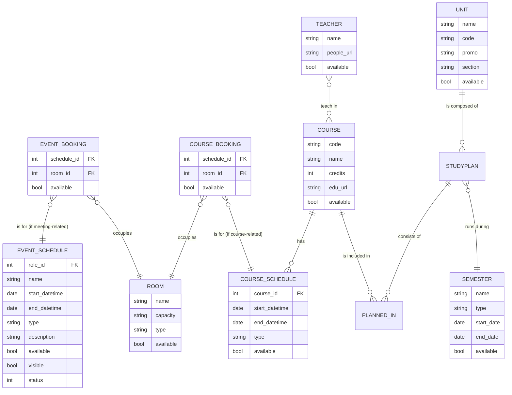

# :clock1: [Occupancy FLEP - Backend](https://occupancy.flep.ch/)

[](https://opensource.org/licenses/MIT)


Interface of edu.epfl.ch, useful for finding free rooms or schedule by studyplan.

## Features

- **Room Availability**: Find available rooms based on selected date and time ranges. The system displays rooms that are not booked during the specified time slots.
  
- **Retrieve Course Information**: Easily find detailed information about a specific course by providing its code. The system retrieves details such as the course's semester, assigned teachers, and schedules.

- **Explore Study Plans**: Explore study plans using their unique study plan ID. The application showcases an interactive and organized timetable that covers the entire semester, highlighting courses, schedules, and room bookings.


## Frontend
   

The frontend repository can be found **[here](https://github.com/antoninfaure/occupancy-front)**

## Scraper
   

The scraper repository can be found **[here](https://github.com/antoninfaure/occupancy-scraper)**

## Backend
    

The current repository is for the backend, which is a Node.js webapp used as a REST API for a MongoDB database, and hosted on Heroku.

### Run

In order to run this project, you must have **[Node.js](https://nodejs.org/)** installed.

1. Install the required dependencies:
```
npm install
```
2. Configure the environnement variables in the `.env` file

3. Launch the Node application:
```
npm run start
```

You can now go to [localhost:5000](http://localhost:5000) to see the page.

## Documentation

The API documentation can be found **[here](https://antoninfaure.github.io/occupancy-epfl/)**

## ER Model



## Contributing

Pull requests are welcome :smile:
- [Androz2091](https://github.com/Androz2091) for the geolocalisation feature
- [buercher](https://github.com/buercher) for creating a [Telegram Bot](https://github.com/buercher/NotEnoughRoomBot)
